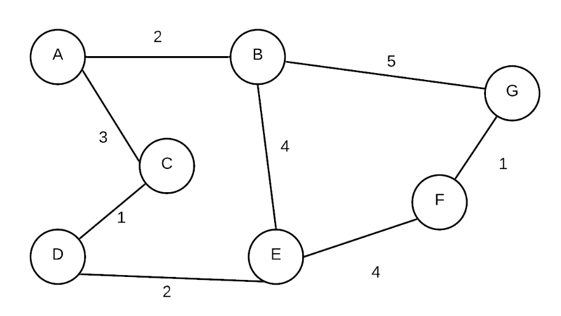
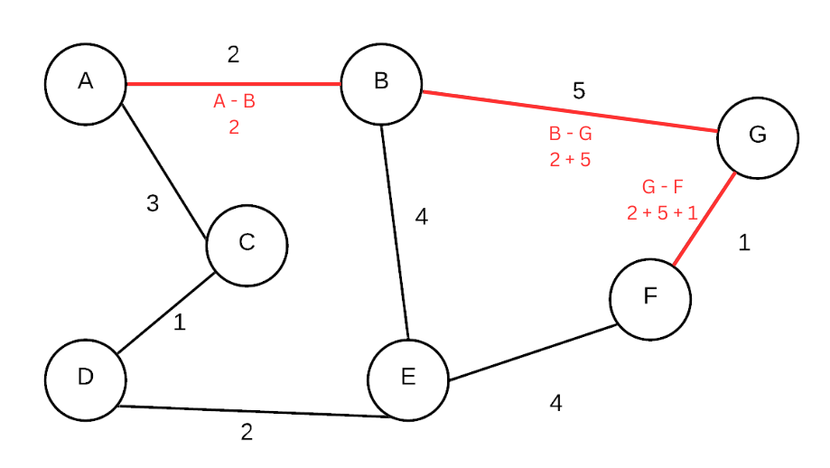
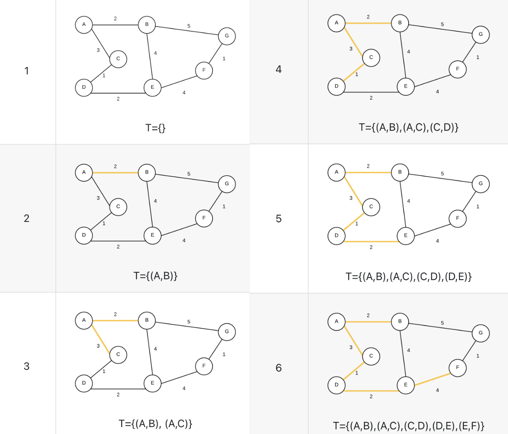
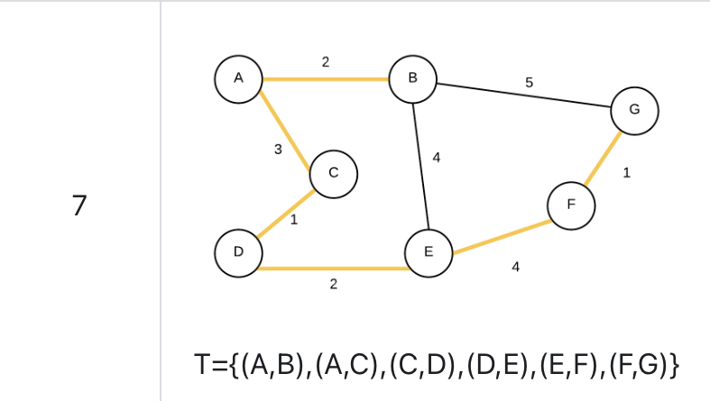

# Graph-Library

This is a C++ library that provides a basic implementation of a graph data structure with various functionalities.

## Table of Contents

- [Features](#features)
- [Getting Started](#getting-started)
- [Usage](#usage)
- [Example Graph](#example-graph)
- [Example Usage](#example-usage)
- [Dijkstra's Algorithm](#dijkstras-algorithm)
- [Minimum Spanning Tree](#minimum-spanning-tree)
- [References](#references)


## Features

- Create a graph with a specified number of vertices.
- Add and remove vertices.
- Add edges between vertices with optional weights.
- Check the existence of edges between vertices.
- Retrieve connected vertices and their weights.
- Count the number of vertices and edges in the graph.
- Find the shortest path from point A to B.
- Find minimum spanning tree from graph.

## Getting Started

1. Clone this repository to your local machine.

```bash
git clone https://github.com/your-username/graph-library.git
```

2. Build the library and program
```bash
  cd graph-library
  mkdir build
  cd build
  cmake ..
  make
```

3. Run the program
```bash
  ./example
```

## Usage

To use this graph library in your own projects, include the graph.h header file and link against the library during compilation.
Make sure to include the appropriate path to the header and library files in your build configuration.


## Example Graph

A graph like this can be built using this library:



see bellow how to create a similar representation.
## Example Usage

```cpp
#include "graph.h"

//labels to be used
std::vector<std::string> vertex_labels = {"A", "B", "C", "D", "E", "F", "G"};

Graph graph;

    // Add vertices
    // Create a graph with vertex labels A, B, C, D, E, F, G
    for (std::string s : vertex_labels)
    {
        graph.add_vertex(s);
    }

    // Add edges
    graph.add_edge("A", "B", 2);    //A -> B with weight 2
    graph.add_edge("A", "C", 3);    //A -> C with weight 3
    graph.add_edge("B", "E", 4);    //B -> E with weight 4
    graph.add_edge("B", "G", 5);    //B -> G with weight 5
    graph.add_edge("C", "D", 1);    //C -> D with weight 1
    graph.add_edge("D", "E", 2);    // D -> E with weight 2
    graph.add_edge("E", "F", 4);    // E -> F with weight 4
    graph.add_edge("F", "G", 1);    // G -> F with weight 1

    std::cout << "Number of vertices: " << graph.num_verts() << std::endl;
    std::cout << "Number of edges: " << graph.num_edges() << std::endl;

    // ... other operations ...

    return 0;
}
```


## Dijkstra's Algorithm
Dijkstra's Algorithm is an algorithm for finding the shortest path from one vertex to every other vertex. This algorithm is an example
of a greedy algorithm. Greedy algorithms are algorithms that find a solution by picking the best solution encountered thus far and expand
on the solution. Dijkstra's Algorithm was first conceived by Edsger W. Dijkstra.

The algorithm works as follows:

1. Start at chosen vertex.
2. Store the weight to travel to each connected vertex.
3. Go to the vertex with the least weight.
4. Continue traversing through the "lightest" path (cost should be calculated from total path, not just the current weight).

### Example
From the same graph above, apply the Dijkstra's algorithm:

```cpp
// ... graph creation ...

// Using dijkstra_shortest_distances to calculate the shortest distances
    int source = "A"; // Source vertex
    std::vector<int> previous_nodes(graph.num_verts(), -1);
    std::vector<int> shortest_distances = graph.dijkstra_shortest_distances(source, previous_nodes);

    std::cout << std::endl << std::endl << "---Dijkstra's Algorithm---" << std::endl;
    for (int i = 0; i < shortest_distances.size(); i++)
    {
    std::cout << "Shortest distance from vertex " << source << " to vertex " << vertex_labels[i] << ": " << shortest_distances[i] << std::endl;
    }
```

Code output:
```
Shortest distance from vertex A to vertex A: 0
Shortest distance from vertex A to vertex B: 2
Shortest distance from vertex A to vertex C: 3
Shortest distance from vertex A to vertex D: 4
Shortest distance from vertex A to vertex E: 6
Shortest distance from vertex A to vertex F: 8
Shortest distance from vertex A to vertex G: 7
```

This represents the shortest path vertex 0 (A) can get to each of the other vertexes.


### Shortest path representation

```cpp
// ... code from above ...
// Using shortest_path to calculate and display the shortest path
    int target = "F"; // Target vertex
    std::string path = graph.shortest_path(source, target);
    std::cout << std::endl << "Shortest path from vertex " << source << " to vertex " << target << " is: " << path << std::endl;
```

Code output:
```
Shortest path from vertex A to vertex F is: A - B - G - F
```

Let's visualize this path in the graph:


The red colored edged represent the path showed in function shortest_path.

it is, calculated using Dijkstra's algorithms, the least costly way to traverse from A to F.


## Minimum Spanning Tree
A Minimum Spanning Tree (MST) is a tree-like subgraph of a given graph that connects all vertices while minimizing the total edge weight or cost.
It's used to find the most efficient way to connect all points in a network with the least possible resource usage.

### Prim's Algorithm
1. Pick a root vertex.
2. Grow the tree by joining the isolated vertex with the smallest edge weight.
3. Repeat until all vertexes are connected.

### Visualize the process



#### last step (complete MST)



### Code
```cpp
    auto mst = graph.minimum_spanning_tree("A");
    graph.display_minimum_spanning_tree(mst, "A");
```

#### output
```
Minimum Spanning Tree starting from vertex A:
A - B (Weight: 2)
A - C (Weight: 3)
A - D (Weight: 1)
A - E (Weight: 2)
A - F (Weight: 4)
A - G (Weight: 1)
Total Weight of MST: 13
```
## References
* https://seneca-ictoer.github.io/data-structures-and-algorithms/G-Graphs/dijkstra
* https://seneca-ictoer.github.io/data-structures-and-algorithms/G-Graphs/mst
